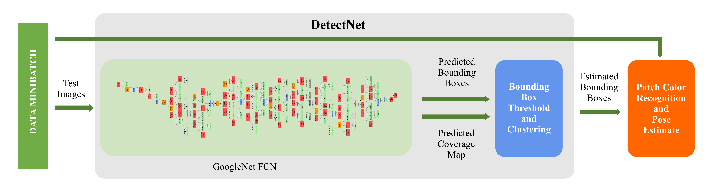
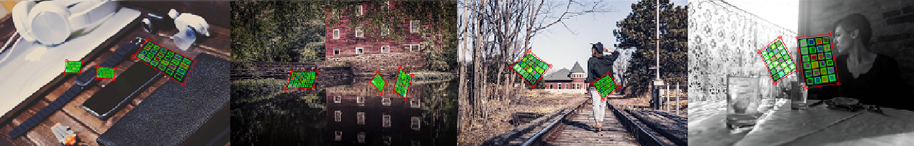
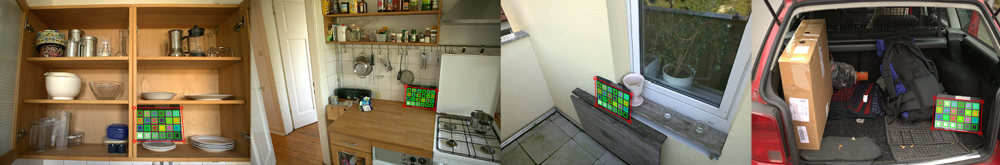
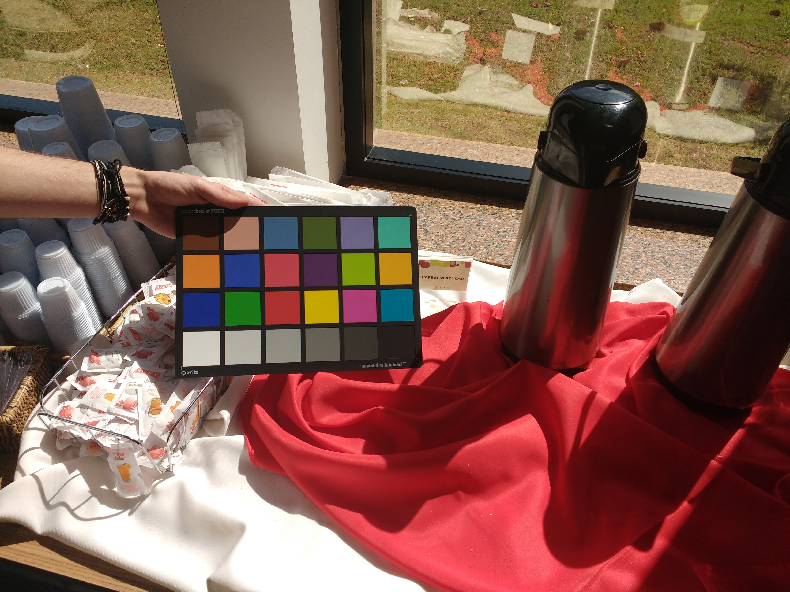

# Fast and Robust Multiple ColorChecker Detection

This code implements a multiple colorChecker detection method, as described in the paper Fast and Robust Multiple ColorChecker Detection. The process is divided into two steps: (1) ColorCheckers localization and (2) ColorChecker patches recognition.

- Results of MCCNetFind for the synthetic dataset

- Results of MCCNetFind for the real dataset

Requirements
------------
You need OpenCV v3.1.0 or later and NVidia Caffe.
This installation package contains support for opencv compilation for Windows in vs.12, vs.14 and mingw.

- apt-get update 
- apt-get upgrade
- [nvcaffe](http://www.nvidia.com/object/caffe-installation.html)
- echo "export PYTHONPATH=/opt/nvcaffe/python" >> ~/.bashrc
- exho "export PATH=/opt/nvcaffe/build/tools:/opt/nvcaffe/python:/usr/local/sbin:/usr/local/bin:/usr/sbin:/usr/bin:/sbin:/bin " >> ~/.bashrc
- source ~/.bashrc
- [opencv]( http://www.pyimagesearch.com/2016/10/24/ubuntu-16-04-how-to-install-opencv/)

Installation
------------
Building the project using CMake from the command-line:

    export OpenCV_DIR="./extern/opencv"
    mkdir build
    cd build
    cmake -D OpenCV_DIR=$OpenCV_DIR ..
    make 

How to use it
-------------

### Preparing the chart

You should have done a photo or video of the ColorChecker Passport.

### Running the MCCFind:

	./build/src/mcc ../db/img-colorchecker.jpg -o=../out -t=1 -sh -gt -nc=0
	./build/src/mcc ../db/vdo-colorchecker.mp4 -o=../out -t=2 -sh -gt -nc=2
	./build/src/mcc ../db/sec-colchecker-0.jpg -o=../out -t=3 -sh -gt -nc=2 -me=10.0

options:

	 -t   # application type - 1 single image, 2 video, 3 image sequence
	 -o   # output dir - default current dir
	 -me  # minimum error
	 -nc  # number maximum of checker color in the image
	 -sh  # show result
	 -gt  # generate table .csv format
      []  # input dir

### Running the MCCFindNet:

	usage: mccfindnet.py [-h] --configurate C [--no-gpu] [--json] [--no-show]
                     [--draw-cam] [--camdevice N] [--border N]

Acknowledgments
------------

This work was supported by the research cooperation project between Motorola Mobility (a Lenovo Company) and CIn-UFPE. Tsang Ing Ren, Pedro D. Marrero Fernandez and Fidel A. Guerrero-Peña gratefully acknowledge financial support from the Brazilian government agency FACEPE. The authors would also like to thank Leonardo Coutinho de Mendonça, Alexandre Cabral Mota, Rudi Minghim and Gabriel Humpire for valuable discussions.